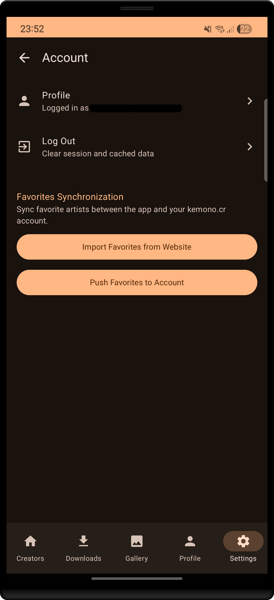
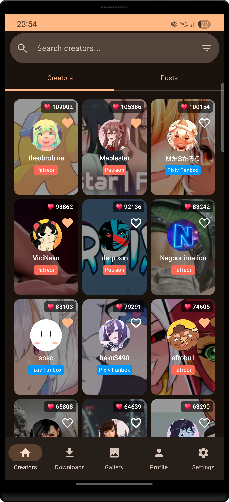
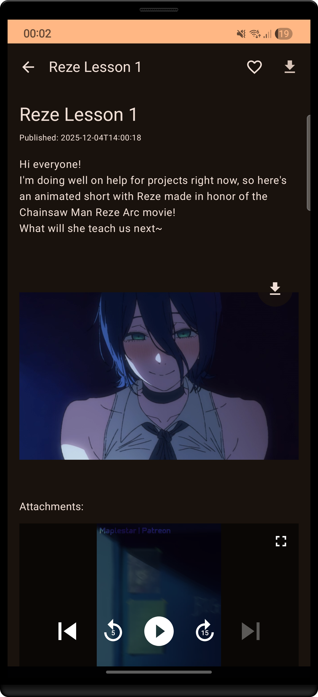
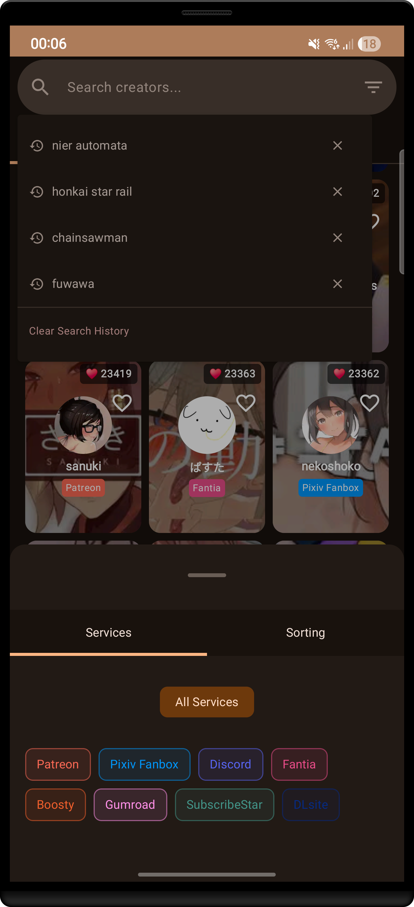
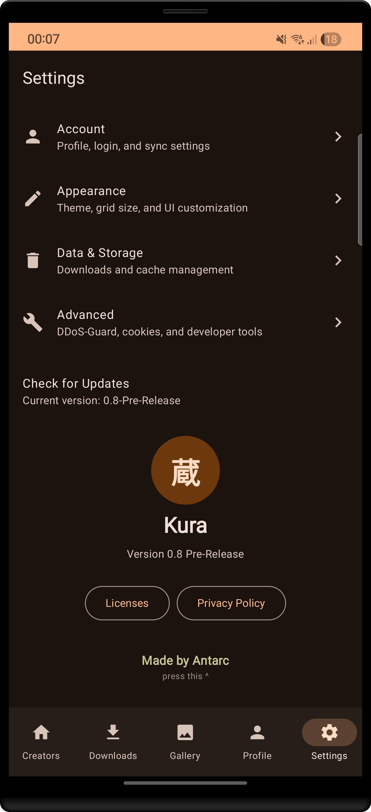

  
  <h1>Kura</h1>
  
<strong>A Native Android Client for Kemono, crafted with love, Kotlin, and Jetpack Compose! (≧◡≦)</strong>

  

    
    
    
     
    
  

---

### *Welcome to the Archives! ヽ(・∀・)ﾉ*

**Kura** is a native Android client for Kemono. Built to be fast, fluid, and (mostly) bug-free! It's your personal portal to catching up on all your favorite creators without needing a browser! 

> [!IMPORTANT]
> **⚠ Pre-Release Build (v0.9)**
> **Update:** We just migrated to Paging 3! If the app catches fire, blame the garbage collector. (⁄ ⁄•⁄ω⁄•⁄ ⁄)
> This project is constantly evolving. Expect bugs, report them, and we'll squish them together!

---

## 📸 Visual Tour

| Login & Sync | Creator Grid | Post Details |
|:---:|:---:|:---:|
|  |  |  |
| *Native Account Integration* | *Customizable Grid Layouts* | *Rich Metadata & Media* |

| Light Mode | Search & History | Settings |
|:---:|:---:|:---:|
|  |  |  |
| *Material 3 Light Theme* | *History & Advanced Filters* | *Data & Cache Control* |

*(psst... new screenshots showcasing the Blacklist and Image Quality settings coming soon! (´｡• ᵕ •｡`)*

---

## ✨ Features (o^▽^o)

### 🚀 Infinite Scrolling (New in v0.9!)
*   **Paging 3 Magic**: Scroll through thousands of posts and creators without your phone melting! Memory instances are aggressively recycled so it stays buttery smooth. 
*   **Image Quality Control**: Save your data! Choose between High, Medium, or Low resolution images dynamically in Settings. 

### 🔐 Native Account & Sync
*   **Seamless Login**: Log directly into your Kemono account within the app. No weird webviews!
*   **Cloud Sync**: Manually synchronize your favorite **Creators** and **Posts** between the app and the website.
*   **Favorites Management**: Add or remove favorites locally, and push changes to your account instantly!

### 🎨 Personalization & Control
*   **Content Blacklist**: Don't want to see certain tags or creators? Banish them to the shadow realm natively! 
*   **Dynamic Layouts**: Choose between **List** or **Grid** views for Creator profiles.
*   **Grid Density**: Control the size of items (Small, Medium, Large) to fit more content.
*   **Autoplay Control**: Toggle GIF autoplay to save battery and RAM.

### 🔍 Discovery
*   **Unified Search**: Search for creators by name or ID with a lag-free, debounced interface.
*   **Search History**: Quickly access your recently searched terms!
*   **Rich Profiles**: View detailed stats, banners, announcements, tags, and linked accounts.
*   **Advanced Filtering**: Filter by Service (Patreon, Fanbox, etc.) with color-coded badges, and sort by Popularity/Date/Name!

### 💾 Intelligent Archiving
*   **SAF Download Support**: Save directly to your SD Card or any folder you choose using Android's native Storage Access Framework!
*   **Inline Downloads**: Automatically detects and downloads images/GIFs embedded in posts.
*   **Bulk Actions**: Long-press to select multiple posts and download them in batch.
*   **Background Manager**: Robust background downloading via `WorkManager` with retry logic and progress notifications.

---

## 🛠 Under the Hood (Don't Look Too Closely (*/ω＼))

*   **Architecture**: MVVM + Clean Architecture styling.
*   **UI**: 100% Jetpack Compose (Material 3).
*   **Network**: Retrofit + OkHttp (Custom Interceptors).
*   **Image Loading**: Coil (Video & GIF support + Hardware Bitmaps).
*   **Persistence**: Room Database (Offline Cache) + DataStore (Settings).
*   **Async**: Kotlin Coroutines + Flow + Jetpack Paging 3.
*   **DI**: Hilt.

---

## 🚀 Get Started

### Installation
1.  Visit the [Releases Page](https://github.com/AntarcDev/Kura/releases).
2.  Download the latest `kura-v0.9.apk`.
3.  Install on Android (7.0+).
4.  **Optional**: Go to **Settings -> Account** to log in and sync your favorites!

### Development
1.  **Clone**: `git clone https://github.com/AntarcDev/Kura.git`
2.  **Open**: Android Studio Hedgehog+ (JDK 17).
3.  **Build**: Run `app` configuration.

---

## 🗺️ Roadmap (Coming Soon!)
*   **Dynamic OLED Themes**: Pure black dark mode to save battery and look sleek!
*   **Custom Color Schemes**: Build your own Material You palettes! (≧◡≦)
*   **First Launch Guide**: A quick, cute tutorial for new users to explain permissions and features.
*   **Tablet Optimization**: A fancy 2-pane dynamic layout specifically designed for bigger screens! 
*   **Enhanced Download Manager**: Live progress indicators for all concurrent downloads at once.
*   **Full Post Archiving**: Option to download an entire post (text, attachments, media) into a single neat archive file.
*   **File Organization**: Better file management and sorting options for your hoarded media!
*   **Fluid Animations**: Silky smooth transitions between screens and elements.
*   **More Optimizations**: Hand-tuned performance tweaks to keep Kura running beautifully on any device!

---

## 🛠️ Troubleshooting & FAQ

**Q: The app keeps giving me HTTP 429 or 502 errors! What do I do? (・_・;)**
> Kemono occasionally goes down or aggressively rate-limits users. Kura has built-in retry logic and DDoS-guard bypasses, but if the server is completely on fire, you might just have to wait a little while!

**Q: Why aren't my downloaded images showing up in my phone's Gallery?**
> Android's internal Media Scanner can sometimes be sleepy. Try waiting a minute, or restarting your device if they really won't show up in your Pictures app! Also, double-check your custom SAF download directory in the app's Data & Storage Settings.

**Q: How do I sync my favorites with my actual Kemono account?**
> Head over to **Settings -> Account** to log in, and you'll find options to push your local favorites to the cloud, or pull cloud favorites to your device!

---

  
Developed entirely by <strong>Antarc</strong>.

  
<i>Luna: "I fixed the memory leak!" (Narrator: She tripped over the ethernet cable).</i>

